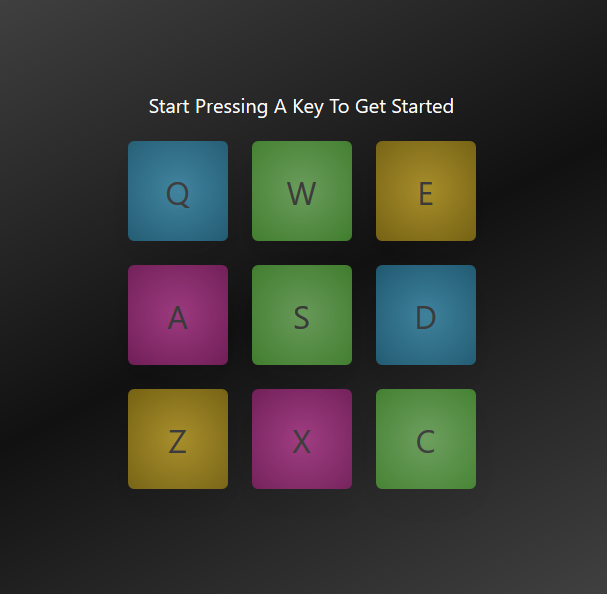

# React Drum Machine

> React.js version of the virtual drum machine with sounds that can be played by clicking the button or pressing the keys. Check it out here: [Live Deployed Link](https://drum-machine-one.now.sh/)

*Screenshot*



---

## Table of Contents

- [Installation](#installation)
- [Features](#features)
- [Contributing](#contributing)
- [Team](#team)
- [License](#license)

---

## Installation

### Clone

- Clone this repo to your local machine using ```git clone https://github.com/muzhaqi16/drum-machine```
- ```cd``` into ```drum-machine```

### Install

- Run ```yarn install | npm install```

### Start

- Run ```yarn start | npm start```

Open [http://localhost:3000](http://localhost:3000) to view it in the browser.

---

## Features

- Play the sounds by pressing the keys on the keyboard
- Play the sounds by clicking the buttons on the screen
- Mobile responsive

---

## Contributing

> I would love your contributions at making this repo better and adding new features. 
> To get started at contributing at this repo follow the steps below...

### Step 1

- **Option 1**
    - 🍴 Fork this repo!

- **Option 2**
    - 👯 Clone this repo to your local machine using `git clone https://github.com/muzhaqi16/drum-machine`

### Step 2

- **HACK AWAY!** 🔨🔨🔨

### Step 3

- 🔃 Create a new pull request using <a href="https://github.com/muzhaqi16/drum-machine/compare" target="_blank">`https://github.com/muzhaqi16/drum-machine`</a>.

---

## Team

<a href="https://muzhaqi.com" target="_blank">**Artan Muzhaqi**</a>

---

## License

[](http://badges.mit-license.org)

- **[MIT license](http://opensource.org/licenses/mit-license.php)**
- Copyright 2020 © <a href="http://muzhaqi.com" target="_blank">Artan Muzhaqi</a>.

This project was bootstrapped with [Create React App](https://github.com/facebook/create-react-app).